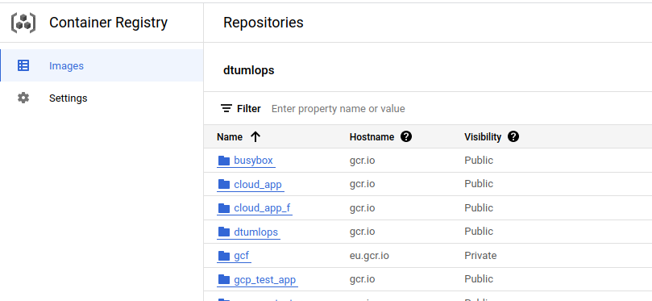

# Exam template for 02476 Machine Learning Operations


This is the report template for the exam. Please only remove the text formatted as with three dashes in front and behind
like:


```--- question 1 fill here ---```


where you instead should add your answers. Any other changes may have unwanted consequences when your report is auto
generated in the end of the course. For questions where you are asked to include images, start by adding the image to
the `figures` subfolder (please only use `.png`, `.jpg` or `.jpeg`) and then add the following code in your answer:


```markdown

```


In addition to this markdown file, we also provide the `report.py` script that provides two utility functions:


Running:


```bash
python report.py html
```


will generate an `.html` page of your report. After deadline for answering this template, we will autoscrape
everything in this `reports` folder and then use this utility to generate an `.html` page that will be your serve
as your final handin.


Running


```bash
python report.py check
```


will check your answers in this template against the constrains listed for each question e.g. is your answer too
short, too long, have you included an image when asked to.


For both functions to work it is important that you do not rename anything. The script have two dependencies that can
be installed with `pip install click markdown`.


## Overall project checklist


The checklist is *exhaustic* which means that it includes everything that you could possible do on the project in
relation the curricilum in this course. Therefore, we do not expect at all that you have checked of all boxes at the
end of the project.


### Week 1


* [x] Create a git repository
* [x] Make sure that all team members have write access to the github repository
* [x] Create a dedicated environment for you project to keep track of your packages
* [x] Create the initial file structure using cookiecutter
* [x] Fill out the `make_dataset.py` file such that it downloads whatever data you need and
* [x] Add a model file and a training script and get that running
* [x] Remember to fill out the `requirements.txt` file with whatever dependencies that you are using
* [x] Remember to comply with good coding practices (`pep8`) while doing the project
* [x] Do a bit of code typing and remember to document essential parts of your code
* [x] Setup version control for your data or part of your data
* [x] Construct one or multiple docker files for your code
* [x] Build the docker files locally and make sure they work as intended
* [x] Write one or multiple configurations files for your experiments
* [x] Used Hydra to load the configurations and manage your hyperparameters
* [x] When you have something that works somewhat, remember at some point to to some profiling and see if
      you can optimize your code
* [x] Use Weights & Biases to log training progress and other important metrics/artifacts in your code. Additionally,
      consider running a hyperparameter optimization sweep.
* [ ] Use Pytorch-lightning (if applicable) to reduce the amount of boilerplate in your code


### Week 2


* [x] Write unit tests related to the data part of your code
* [x] Write unit tests related to model construction and or model training
* [x] Calculate the coverage.
* [x] Get some continuous integration running on the github repository
* [x] Create a data storage in GCP Bucket for you data and preferable link this with your data version control setup
* [x] Create a trigger workflow for automatically building your docker images
* [x] Get your model training in GCP using either the Engine or Vertex AI
* [x] Create a FastAPI application that can do inference using your model
* [ ] If applicable, consider deploying the model locally using torchserve
* [x] Deploy your model in GCP using either Functions or Run as the backend


### Week 3


* [ ] Check how robust your model is towards data drifting
* [x] Setup monitoring for the system telemetry of your deployed model
* [ ] Setup monitoring for the performance of your deployed model
* [ ] If applicable, play around with distributed data loading
* [ ] If applicable, play around with distributed model training
* [ ] Play around with quantization, compilation and pruning for you trained models to increase inference speed


### Additional


* [x] Revisit your initial project description. Did the project turn out as you wanted?
* [x] Make sure all group members have a understanding about all parts of the project
* [x] Uploaded all your code to github


## Group information


### Question 1
> **Enter the group number you signed up on <learn.inside.dtu.dk>**
>
> Answer:


--- 31 ---


### Question 2
> **Enter the study number for each member in the group**
>
> Example:
>
> *sXXXXXX, sXXXXXX, sXXXXXX*
>
> Answer:


--- s220493, s223306, s212584, s212441 ---


### Question 3
> **What framework did you choose to work with and did it help you complete the project?**
>
> Answer length: 100-200 words.
>
> Example:
> *We used the third-party framework ... in our project. We used functionality ... and functionality ... from the*
> *package to do ... and ... in our project*.
>
> Answer:


--- We used the third-party transformers framework from huggingface specifically we used the `Vision Transformer (ViT)` model, which is a deep learning model and a transformer that is targeted at vision processing tasks such as image recognition, in our project. From the transformers library we utilized the classes AutoFeatureExtractor, for transformation of input images and AutoModelForImageClassification, which loads the ViT model and configures it with the relevant number of outputs for our problem. From the package to extract features from our images and package for pretrain model (ViT) for our project. The above framework helped us a lot achieve our goal of extracting features from our data and distinguishing different types of features (e.g. Bird Breed) from images. ---


## Coding environment


> In the following section we are interested in learning more about you local development environment.


### Question 4


> **Explain how you managed dependencies in your project? Explain the process a new team member would have to go**
> **through to get an exact copy of your environment.**
>
> Answer length: 100-200 words
>
> Example:
> *We used ... for managing our dependencies. The list of dependencies was auto-generated using ... . To get a*
> *complete copy of our development environment, one would have to run the following commands*
>
> Answer:


---   Initially, a Linux terminal is highly recommended to have otherwise the use of WSL or Chocolatey for Windows users are also helpful, but in any case the whole project could be implemented through any operating system.
Next step is the installation of Anaconda, which has been used for the creation of the environment where we host our project’s necessary packages. Different environments secure the reproducibility among the users.
After the installation of git and cloning the repo of the project, regarding the prerequisites requirements we have created three different .txt files for each of the following procedures: training/predict, tests and app deployment. We followed this procedure in order to minimize the docker image of the app and test. The pipreqs package ran initially to identify the required packages for the requirements file but a few more packages had been added manually.
All in all, a make requirements command is just enough to install all the required packages for the project. ---
 
### Question 5


> **We expect that you initialized your project using the cookiecutter template. Explain the overall structure of your**
> **code. Did you fill out every folder or only a subset?**
>
> Answer length: 100-200 words
>
> Example:
> *From the cookiecutter template we have filled out the ... , ... and ... folder. We have removed the ... folder*
> *because we did not use any ... in our project. We have added an ... folder that contains ... for running our*
> *experiments.*
> Answer:


--- From the cookie cutter template we have filled out the `src` folder with the Source code for use in our project with scripts to label data and to train models  and then use trained models to make predictions, `data` folder for preprocessing the original/raw data dump to the final processed data. We haven't used any figures, notebooks and docs and we didn't have any references added thus we removed `figures`, `notebooks`, `docs`, `references` folders. Additionally we have added a folder for our final report and related files. Also a test folder that contains experiments we run on our code from Py-test in the final week, for running our code experiments `reports` and `tests`. ---


### Question 6


> **Did you implement any rules for code quality and format? Additionally, explain with your own words why these**
> **concepts matters in larger projects.**
>
> Answer length: 50-100 words.
>
> Answer:


---  First of all, regarding Documentation we have added to the point comments in all our scripts but not too many because we haven’t written too much code as we have used mainly already used one.
Regarding Styling, pep8 through flake8 (code compliance) and black (code formatting), and isort (import statements in python organizer) are the packages were used.
Moreover, we tried to improve code’s quality through Typing  including the data types.
As a conclusion, these concepts really matter in larger projects to facilitate both initial development and subsequent maintenance and enhancement of source code by authors or others. ---


## Version control


> In the following section we are interested in how version control was used in your project during development to
> corporate and increase the quality of your code.


### Question 7


> **How many tests did you implement and what are they testing in your code?**
>
> Answer length: 50-100 words.
>
> Example:
> *In total we have implemented X tests. Primarily we are testing ... and ... as these the most critical parts of our*
> *application but also ... .*
>
> Answer:


--- In total, we have implemented one test for the make dataset script.  Through the test we check for the followings:
The total number of classes in each dataset.
All the classes in test and valid sets are included in the train set.
Validation/testing and training datasets shapes.
The training/validation/test dataset class outputs a different number of points than there are images. ---


### Question 8


> **What is the total code coverage (in percentage) of your code? If you code had an code coverage of 100% (or close**
> **to), would you still trust it to be error free? Explain you reasoning.**
>
> Answer length: 100-200 words.
>
> Example:
> *The total code coverage of code is X%, which includes all our source code. We are far from 100% coverage of our **
> *code and even if we were then...*
>
> Answer:


--- The current code coverage for the dataset code is at 53%, however, testing for the training and prediction code has not been conducted. As a result, it is likely that errors in these areas will go undetected. There are various reasons that can contribute to a project's failure such as incorrect dependencies, improper deployment, lack of permissions, or corrupted data. To ensure the success of the project, it is crucial to pair the analysis with comprehensive and robust test scripts that cover all functional and non-functional areas of the code. These test scripts should be scalable and robust, ensuring that all the aspects of the source code are thoroughly covered. ---


### Question 9


> **Did your workflow include using branches and pull requests? If yes, explain how. If not, explain how branches and**
> **pull request can help improve version control.**
>
> Answer length: 100-200 words.
>
> Example:
> *We made use of both branches and PRs in our project. In our group, each member had an branch that they worked on in*
> *addition to the main branch. To merge code we ...*
>
> Answer:


--- In our project we used both branches and PRs. The logic is that each member was creating a branch for a feature he was implementing, and when it was done, he was pushing it on github. Then he was creating a new pull request (PR), which had to be reviewed and approved by one more member of the team. So, by using branches we are sure that we isolate the changes around a feature in one place, so we can easily troubleshoot a future problem, but additionally working in a safe environment during development. By using PRs, we are ensuring that the code is reviewed and maybe modified before committed, so it doesn’t break. ---


### Question 10


> **Did you use DVC for managing data in your project? If yes, then how did it improve your project to have version**
> **control of your data. If no, explain a case where it would be beneficial to have version control of your data.**
>
> Answer length: 100-200 words.
>
> Example:
> *We did make use of DVC in the following way: ... . In the end it helped us in ... for controlling ... part of our*
> *pipeline*
>
> Answer:


---  We did make use of DVC. The tool works on top of git and cloud services. DVC helped us with the collaboration of our project. By using this cloud service we could sync the same version of our data with the cloud and thus all group members could work on the latest data set. We were using the dvc for "data" cloud bucket by saving objects (the newest version of our data in this case) and container "models" that contain the training weights. In the end it helped us collaborate and sometimes revert to old bucket versions for controlling our weights and thus our models.  ---


### Question 11


> **Discuss you continues integration setup. What kind of CI are you running (unittesting, linting, etc.)? Do you test**
> **multiple operating systems, python version etc. Do you make use of caching? Feel free to insert a link to one of**
> **your github actions workflow.**
>
> Answer length: 200-300 words.
>
> Example:
> *We have organized our CI into 3 separate files: one for doing ..., one for running ... testing and one for running*
> *... . In particular for our ..., we used ... .An example of a triggered workflow can be seen here: <weblink>*
>
> Answer:


--- We have organized our CI into 3 separate files: one for formatting the code, one for running the tests that we created and one for sorting the imports of our code. For the formatting of the code we are using the *black* Python code formatter,which formats the code making it look nice and consistent, being compliant with PEP8. The sorting is done by using the  isort library to sort imports alphabetically, and automatically separated into sections and by type. Finally, we are running the unit tests that we are created with pytest and are made to ensure that some parts of the code are having the correct inputs and outputs, and also some other functionalities. Additionally, all three files are created to test the experiments in different operating systems (ubuntu, and windows) and also two python versions (3.9, 3.10). Furthermore, we have also implemented caching in our workflow files, in order to make the actions faster, and make use of the cache capability the github is offering. The cache that github offers, is essentially storing the data in every previous commit, and uses the data that is common, in the future ones. An example of a triggered workflow can be seen here:
<https://github.com/manganas/mlops_project_2023/actions/runs/3968820858>---


## Running code and tracking experiments


> In the following section we are interested in learning more about the experimental setup for running your code and
> especially the reproducibility of your experiments.


### Question 12


> **How did you configure experiments? Did you make use of config files? Explain with coding examples of how you would**
> **run an experiment.**
>
> Answer length: 50-100 words.
>
> Example:
> *We used a simple argparser, that worked in the following way: python my_script.py --lr 1e-3 --batch_size 25*
>
> Answer:


--- Our system employed the use of hydra to manage and organize various important elements such as directory paths, hyperparameters, and prefixes for saved models. A starting configuration file in yaml format was established to serve as the default setup for experiments. All experiment configuration files were then stored in a dedicated folder named "experiment". Additionally, another directory named "optimizers" was created to house different configurations for optimizers. —---


### Question 13


> **Reproducibility of experiments is important. Related to the last question, how did you secure that no information**
> **is lost when running experiments and that your experiments are reproducible?**
>
> Answer length: 100-200 words.
>
> Example:
> *We made use of config files. Whenever an experiment is run the following happens: ... . To reproduce an experiment*
> *one would have to do ...*
>
> Answer:


---To ensure reproducibility, we initially added the configuration files in git, so that any changes can be reverted and rolled back. Afterwards, we used configuration files with all the hyperparameters stored. The experiment number that corresponds to each file is saved as prefix to the model checkpoint files. Afterwards, for reproducibility, docker containers were built and run for training and test/inference. We only used one image for Python for faster builds, however we could have used images with different operating systems and/or versions of Python. For the local docker images, the data was copied to the image. For the google cloud triggered builds in Cloud Build, the data were acquired using dvc pull inside the container.---


### Question 14


> **Upload 1 to 3 screenshots that show the experiments that you have done in W&B (or another experiment tracking**
> **service of your choice). This may include loss graphs, logged images, hyperparameter sweeps etc. You can take**
> **inspiration from [this figure](figures/wandb.png). Explain what metrics you are tracking and why they are**
> **important.**
>
> Answer length: 200-300 words + 1 to 3 screenshots.
>
> Example:
> *As seen in the first image when have tracked ... and ... which both inform us about ... in our experiments.*
> *As seen in the second image we are also tracking ... and ...*
>
> Answer:


---  
Wandb is a powerful tool that enables us to keep tabs on the performance of our experiments by logging the training and validation set accuracy and losses for each epoch. The tool allows us to easily monitor the progress of our experiments and evaluate their performance. In this particular case, we did not focus on precision and recall as our application is intended for general public use. The loss function we used is CrossEntropy, which is already built into the huggingface model.
In the image above, we can see two logged experiments. The blue line represents an experiment that was conducted with a larger batch size, a learning rate scheduler, and the Adam optimizer. On the other hand, the purple line at the bottom represents an experiment with a smaller batch size and a fixed learning rate. By plotting the training and validation losses, we were able to ensure that there was no overfitting. The accuracy was used as a metric to evaluate the training performance.
It's worth noting that running the experiments for more epochs would likely yield better results than what is shown in the current data. This is because more training data would provide the model with more opportunities to learn and improve its performance. Overall, Wandb is a valuable tool that helps us to monitor and evaluate our experiments, making it easier to identify and correct any issues that may arise.---


### Question 15


> **Docker is an important tool for creating containerized applications. Explain how you used docker in your**
> **experiments? Include how you would run your docker images and include a link to one of your docker files.**
>
> Answer length: 100-200 words.
>
> Example:
> *For our project we developed several images: one for training, inference and deployment. For example to run the*
> *training docker image: `docker run trainer:latest lr=1e-3 batch_size=64`. Link to docker file: <weblink>*
>
> Answer:


--- For our project we developed several images: one for training in cpu, one for training in gpu, one for inference, one for deployment locally, and one for gcloud deployment. The cpu and gpu images for training are copying the needed files, install the requirements, mount to the correct directory, doing a dvc pull, to get the training data, and then initiate the training. The inference image, is following the same steps but running the prediction in the end. Respectively, the deployment images are following the same steps, but in the end they run the uvicorn command to run the FastAPI app. We have also created make commands that can initiate the commands to create the docker images. For example to run the training gpu docker image is ```docker run -e WANDB_API_KEY= $$KEY  --name $$NAME --gpus all  -v $(pwd)/models:/models gpu_docker_trainer:latest```. Link to docker file: <https://console.cloud.google.com/gcr/images/pelagic-river-374308/GLOBAL/cloud_app_f@sha256:27446c4bb57f9a873aa8c64040e408eac22b4b9c60e5b177c904868659831958/details> ---


### Question 16


> **When running into bugs while trying to run your experiments, how did you perform debugging? Additionally, did you**
> **try to profile your code or do you think it is already perfect?**
>
> Answer length: 100-200 words.
>
> Example:
> *Debugging method was dependent on group members. Some just used ... and others used ... . We did a single profiling*
> *run of our main code at some point that showed ...*
>
> Answer:


---For debugging, we mostly used the builtin VSCode debugger, in an interactive GPU mode in the HPC when the GPU was tested. Due to the nature of the code, using a pretrained model, the crash logs were also easy to use to correct the code. Some calls to log.info were also made.Given that the code structure was not overly complex, profiling was only performed as an application of the course. The highest repetition is in the `__getitem__` method of the dataset and the forward method of the model. We did not write custom functions to test if they impact the speed of the code. We used cProfile and snakeviz to see the results of profiling our code. Finally, profiling was added as a command in the Makefile.---


## Working in the cloud


> In the following section we would like to know more about your experience when developing in the cloud.


### Question 17


> **List all the GCP services that you made use of in your project and shortly explain what each service does?**
>
> Answer length: 50-200 words.
>
> Example:
> *We used the following two services: Engine and Bucket. Engine is used for... and Bucket is used for...*
>
> Answer:


--- Cloud Storage: Use of buckets to store data and saved models. DVC pulls them from this bucket. VertexAI: Used to run the custom jobs from the vm, eg. training, Cloud Build: Builds the dockerfiles after every pull request (using Triggers). These images are used from Vertex AI., Compute Engine: We used it initially to create vm’s to ssh into and clone our project repository. We abandoned it for the sake of custom jobs in vertex AI, Container Registry: We used it to push the docker images for the fastapi app., Monitoring: Created an alert for the number of log entries to our app. Triggers*, Cloud Run, Billing, ---


### Question 18


> **The backbone of GCP is the Compute engine. Explained how you made use of this service and what type of VMs**
> **you used?**
>
> Answer length: 100-200 words.
>
> Example:
> *We used the compute engine to run our ... . We used instances with the following hardware: ... and we started the*
> *using a custom container: ...*
>
> Answer:


---  We have run our first training experiment on Compute Engine. First of all, we used VertexAI through ai custom-jobs with a `configuration.yaml` file to first create a VM with the specs specified by the .yaml file, then load a container specified again in the .yaml file and finally it runs everything. In order to achieve the best results, we tried different types of VMs, both CPU and GPU. Regarding GPU, the parameters are  :     `machineType`: n1-standard-8, `acceleratorType`: NVIDIA_TESLA_T4, `acceleratorCount`: 1 and `replicaCount`: 1, and for CPU the only difference is the `machineType`:n1-highmem-2 and of course the absence of GPU.
We used custom jobs to train the models from images, which in a sense spawn the vm and run the image once it is built.  ---


### Question 19


> **Insert 1-2 images of your GCP bucket, such that we can see what data you have stored in it.**
> **You can take inspiration from [this figure](figures/bucket.png).**
>
> Answer:


---  ---


### Question 20


> **Upload one image of your GCP container registry, such that we can see the different images that you have stored.**
> **You can take inspiration from [this figure](figures/registry.png).**
>
> Answer:


---  ---


### Question 21


> **Upload one image of your GCP cloud build history, so we can see the history of the images that have been build in**
> **your project. You can take inspiration from [this figure](figures/build.png).**
>
> Answer:


---   ---


### Question 22


> **Did you manage to deploy your model, either in locally or cloud? If not, describe why. If yes, describe how and**
> **preferably how you invoke your deployed service?**
>
> Answer length: 100-200 words.
>
> Example:
> *For deployment we wrapped our model into application using ... . We first tried locally serving the model, which*
> *worked. Afterwards we deployed it in the cloud, using ... . To invoke the service an user would call*
> *`curl -X POST -F "file=@file.json"<weburl>`*
>
> Answer:


--- We used the Google service Cloud Run Cloud to deploy a containerized fastapi based application. To test that the app works, the following steps were followed: 1. Local deployment using uvicorn. 2. Local deployment using docker. 3. Tagging and pushing the docker image to gc. Create a new service with the correct amount of RAM and the port specified in the dockerfile of the app. Assuming the user is in a directory with the images to use, run  ```curl -X POST 'https://classifier-app-f-jfaciuiyva-ew.a.run.app/predict' \          
-F 'data=@2.jpg' ```
The response is a json file with status code, the predicted class and the probability of the prediction.---


### Question 23


> **Did you manage to implement monitoring of your deployed model? If yes, explain how it works. If not, explain how**
> **monitoring would help the longevity of your application.**
>
> Answer length: 100-200 words.
>
> Example:
> *We did not manage to implement monitoring. We would like to have monitoring implemented such that over time we could*
> *measure ... and ... that would inform us about this ... behavior of our application.*
>
> Answer:


--- The only monitoring we created for our project, was through the Monitoring service of Google cloud, to log if the requests are higher than a threshold. We would like to have monitoring implemented, especially if we could store the requested images from the users in a database. Moreover, the feedback from each inference call could be saved. Monitoring would allow for our app and model the following: 1. Know if, when and with which input our app potentially crashed or did not perform as expected. 2. Detect drift in the input data, so that we are alerted and re-train the model with new data from this distribution. 3. We could also log the performance of our application in terms of time to execute each inference call and possibly profile it if we think there is a bottleneck.---


### Question 24


> **How many credits did you end up using during the project and what service was most expensive?**
>
> Answer length: 25-100 words.
>
> Example:
> *Group member 1 used ..., Group member 2 used ..., in total ... credits was spend during development. The service*
> *costing the most was ... due to ...*
>
> Answer:


--- ```s220493: $23.65```
    ```s223306: $19.12```
    ```s212441: $49.83```
    ```s212584: $0```
  The main cost is compute engine due to the VMs with GPU. Especially, in case they are not stopped when they are not used. ---


## Overall discussion of project


> In the following section we would like you to think about the general structure of your project.


### Question 25


> **Include a figure that describes the overall architecture of your system and what services that you make use of.**
> **You can take inspiration from [this figure](figures/overview.png). Additionally in your own words, explain the**
> **overall steps in figure.**
>
> Answer length: 200-400 words
>
> Example:
>
> *The starting point of the diagram is our local setup, where we integrated ... and ... and ... into our code.*
> *Whenever we commit code and push to github, it auto triggers ... and ... . From there the diagram shows ...*
>
> Answer:


---  
The starting point of the diagram is the pytorch code which includes the contents of the src folder and also modules for the model, training, prediction and datasets. The layout of the whole project follows the cookiecutter layout for data science. Git, distributed version control system, is used for version control and github is used for hosting the remote repository. The data, raw images, is tracked via dvc and stored in a bucket, Google Cloud Storage. 
Every member contributes to the codebase by pull requests, which must be reviewed and approved by one other member. Every time changes in a branch are committed, pre-commit hooks ensure the format of the code follwing pep8 which ensures nice formatting. After the pull request is accepted and the code merged, the code is tested using github actions on Ubuntu and Windows with Python 3.9 and 3.10 version. Moreover, isort is run and all the unit tests are executed. At the same time, the docker images for training on cpu and gpu are built on Cloud Build. After the build is completed, a cli command begins a vertex ai VM that runs the built images’ containers, to train the model. All the configurations for the code, like model hyperparameters and paths are stored  in the hydra config files. Moreover, the desired logs are initiated to the wandb account by using an api key stored in the docker container. 
Finally, when the saved model has been acquired, a fastapi application is built in the folder app. Initially it is tested locally, afterwards, a docker image of the app is built and tested again locally, before it is tagged and pushed to the Container Registry. After the image is built on the Registry, a command launches a new Cloud Run service using the correct port. It is possible then for anyone to send requests to the app. Monitoring sends an email once a day if the mean value of the requests surpasses a threshold of 2.---


### Question 26


> **Discuss the overall struggles of the project. Where did you spend most time and what did you do to overcome these**
> **challenges?**
>
> Answer length: 200-400 words.
>
> Example:
> *The biggest challenges in the project was using ... tool to do ... . The reason for this was ...*
>
> Answer:


---An initial struggle was to set a model up so that the training works as expected. Moreover, loading the data and storing them in an efficient way was challenging. Initially, we used huggingface’s load_dataset class, which cached all the data. However, when training, it produced a temporary folder of size around 40G that made it difficult to work in the cloud. This was solved by not changing the make_dataset.py file to use torchvision’s ImageFolder class. The data need not be saved as tensors, since `__getitem__` now feeds them as tensors after transforming them.
Another difficult point was how to use API keys inside docker containers that were built and run on Google Cloud. For the majority of the cases, we directly stored the keys in the dockerfile, which might not be the best solution.  
We also run into some cases where the conda src folder could not be installed and classes from different modules be imported into other files. We solved this by creating a new environment from the requirements file.
Moreover, we did not manage to run any training using GPU using vertex ai. The gpu images from nvidia kept failing when they were built. Moreover, we did not manage to create a vm with GPU from these images. We used the GPU of the HPC eventually. Training only with CPU was extremely slow, so most instances were stopped and were kept as experiments.  
Finally, the Cloud Functions service was not used, since the inference function had large dependencies and was very slow to deploy and edit, so that debugging could be performed. We settled with Cloud Run.
API keys inside of containers, uploaded to gc. Getting the model to work and not create a large amount of data, so that dvc pull can be performed online inside the containers. ---


### Question 27


> **State the individual contributions of each team member. This is required information from DTU, because we need to**
> **make sure all members contributed actively to the project**
>
> Answer length: 50-200 words.
>
> Example:
> *Student sXXXXXX was in charge of developing of setting up the initial cookie cutter project and developing of the*
> *docker containers for training our applications.*
> *Student sXXXXXX was in charge of training our models in the cloud and deploying them afterwards.*
> *All members contributed to code by...*
>
> Answer:

--- Student s212441 was in charge of setting up the initial cookie cutter project and developing of the docker containers for training our applications. Student s223306 worked on Parameters with Hydra and DVC. Student s220493 was in charge of training our models in the cloud and deploying them afterwards. Student s212584 contributed on Fast APIs segment. All members contributed to code equally. ---


